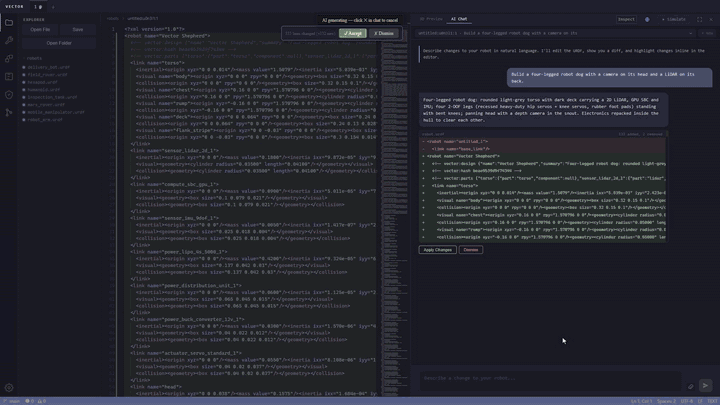

# Vector

Describe a robot in plain English and Vector builds it. Ask for a quadruped and
the AI assembles a kinematic chain from a parts catalog, then hands you a URDF
you can edit by hand and run in a MuJoCo sim.

It's a desktop app built with Tauri: a Rust shell around a Python core, with a
Three.js viewport and a Monaco editor up front. The core runs the robot
designer, the simulator and the Claude calls over JSON-RPC.

> Status: v0.2.0, a working prototype. Expect sharp edges.

[](https://github.com/KenC2006/Vector/releases/download/v0.2.0/vector_demo.mp4)

**[Watch the full demo (3.5 min)](https://github.com/KenC2006/Vector/releases/download/v0.2.0/vector_demo.mp4)**:
a robot dog designed from one sentence, edited by hand and by chat, then
simulated alongside a hexapod, rovers, a tank and an arm.

## What it does

The AI never writes XML. It designs the robot as an explicit list of parts —
catalog hardware plus custom body shells — each placed where it goes: a point,
or "this part's connector flush against that part's face", with its axes and
joints stated outright. A small compiler (`core/designer/`) turns that into a
URDF exactly as written; nothing is moved or re-oriented behind the model's
back. A geometry critic then measures the result — floating or clipping
parts, what touches the ground, tipping, and whether every driven joint can
carry its load — and the model revises until the report is clean.

The design rides along inside the URDF, so follow-up requests ("add an arm on
its back") edit the same design rather than starting over.

## Editing by hand

There is one model of the robot — the design — and every way of editing it
goes through the same compiler:

- **Components panel**: pick any catalog part and point at the robot. The part
  snaps to a free connector you can see, or flush onto the face under the cursor
  at that exact spot; the ghost is computed with the compiler's own mate math,
  so the part lands exactly where it was shown. Tab picks which of the part's
  anchors mates, R spins it about the mate normal (it starts upright), J sets the
  joint, `[` `]` set the length of cut-to-length parts. Pointing at empty floor
  drops it free, attached to the selected part.
- **Gizmo**: moving a mated part slides it along the face it's mounted on;
  rotating it about the mate normal changes its spin, any other rotation sets its
  axes explicitly. Children placed on it follow.
- **Properties**: the part's real fields — what it's attached to and where, which
  of its anchors mates, spin or explicit axes, length, joint type/axis/rest
  angle/limits, passive, mirror — plus what's mounted on it and its measured
  pose. Every change recompiles and the critic's notes come back immediately.

The URDF can still be edited as text. Vector stamps what it generated; if the
text no longer matches, the edit is merged back into the design: parts you
changed take their pose from the URDF, everything else keeps its mates. Any
other URDF (hand-written, from elsewhere, with meshes) is imported the same way
the first time you edit it — every link at its exact pose, joints, limits,
names and masses kept — so the AI and the editor work on any robot.

Which catalog part a link is comes from the `<!-- vector:parts -->` map the
compiler writes, not from link names.

From there the URDF is yours. Monaco on the left, live 3D on the right; save and
the scene reparses. Geometry hot-reloads, so when a part's GLB finishes loading
the viewport swaps the procedural stand-in for the real CAD without touching
your camera. AI edits arrive as inline Monaco diffs: Accept keeps them,
Dismiss reverts. Chat is scoped per file, so every URDF tab keeps its own history.

## The catalog

147 presets in 10 categories: actuators, motors, sensors, compute, power,
structural, transmission, end effectors, mobility, and drivetrain. Each one
ships with authored mate connectors and a procedural visual; 63 of them render
from a GLB converted from manufacturer CAD (per-part mesh, rotation and scale
overrides live in `src/src/richVisuals/visualOverrides.json`), and many carry a
convex-hull collision mesh.

## Simulation

Hit Simulate and the URDF converts to MJCF and loads into MuJoCo. Joints are position
servos, wheels and track drives are speed-controlled motors, and pivots with no
motor behind them (a rocker-bogie) swing freely. Tracked modules become a row of
ganged rollers, so tanks drive too.

A controller is a Python `step(t, state)` called at a fixed 200 Hz. `state`
carries joint positions and speeds, the base pose and velocity, which links touch
the ground, and the operator's command, so controllers can close the loop.
While the sim runs, WASD or the arrow keys drive the robot through that command.

- **Quick** builds a controller instantly, without AI, from measuring the robot.
  It works out what each joint's positive direction actually does to the foot or
  tip, and which way each wheel rolls the robot. From that it gets
  differential/skid drive for wheels and tracks, and a trot or tripod gait mapped
  through each leg's measured Jacobian.
- **Generate** hands that brief to Claude with your request ("patrol back and
  forth", "trot as fast as it can"). Claude writes a controller, runs it headless
  in the same physics, and reads what actually happened: distance, heading,
  tilt, falls, tracking, torque saturation. It revises until the numbers look
  right, then returns tested code with a measured summary.

Toggle gravity, and switch between flat, rough, and stairs terrain.

## Getting started

You'll need Rust, Node, Python 3.10+, and the Tauri CLI (`cargo install tauri-cli`).

```bash
# Python core
pip install -r core/requirements.txt

# Frontend
cd src && npm install && cd ..

# Run — boots the Vite dev server and the desktop shell together
cargo tauri dev
```

Every AI feature (designing and editing robots, sim-controller generation)
runs on Claude. Put your key in a `.env` in the repo root:

```env
ANTHROPIC_API_KEY=sk-...
# Only for org-level keys that aren't scoped to a workspace:
# ANTHROPIC_WORKSPACE_ID=wrkspc_...
```

## Tests

`npm run check`, run from `src/`, is the full gate. The suites that carry the most weight:

- **Designer corpus**: the emitted URDF, run through standard URDF kinematics, must put every part exactly where the designer placed it; mirroring, rest angles, joint limits and the critic's float/overload checks are pinned. Importing any URDF must be lossless, and moving or turning any single joint of a real robot by hand must merge back into its design exactly.
- **Controller corpus**: joint limits in radians, wheels rolling at wheel speed, drivable tracks, passive pivots, and baseline drive/turn/trot controllers moving the right way.
- **Catalog physics**: contact classes and actuator ratings come from catalog data, and the MJCF friction/gains follow them.
- **Rotation parity**: the editor's TypeScript placement math and the Python compiler agree with a frozen rotation corpus.
- **Visual parity**: every part's visual fills its catalog bbox and faces the way its connectors say.
- **Collision envelope**: each preset's `bbox_mm` has to match its convex-hull mesh within 15%.
- **Mesh extents** flags any GLB whose rendered size drifts more than 5% from its authored bbox.

A git hook at `.githooks/pre-commit` runs the gate before every commit. Install
it with `npm --prefix src run install-hooks`.

## Layout

```
src/          Tauri frontend (TypeScript, Vite)
src/src/      App code: main.ts, assemblyEditor.ts (manual editing),
              design/ (design model + placement math), viewportChat.ts,
              richVisuals/, simManager.ts
src/public/   Component catalog: presets, GLBs, collision meshes
assets/       Source CAD (STEP + .binbrep) and GLBs no part renders; not shipped
src-tauri/    Rust shell; owns the Python core process
core/         Python: JSON-RPC server, robot designer (core/designer/:
              compiler, critic, URDF importer, design agent), URDF/MJCF
              converter and controller runtime (core/sim/), controller agent
              (core/ai/controller_agent.py)
scripts/      One-off tooling: collision regen, bbox audits, catalog validators
docs/media/   README media
```
